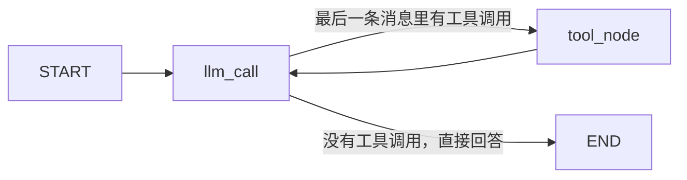

# LangGraph 快速入门：`1.py` 在做什么

这段代码在搭一个会循环的小助手：模型先看你的问题，需要算数就去调工具，拿到结果后再看一遍，直到它能直接回答为止。

可以把它想成三样东西配合工作：

- **记事本（state）**：目前为止说过的话，以及模型被叫过几次。
- **两个办事的人（node）**：一个是模型，负责决定下一步；一个是工具执行器，负责真的去算。
- **流程图（graph）**：规定谁做完之后交给谁。

整张图只有这一条环：



下面按文件里的 Step 1 到 Step 6 说明每一块在这条环里干什么。

## Step 1：准备模型和三个计算器

```python
@tool
def multiply(a: int, b: int) -> int:
    """Multiply `a` and `b`."""
    ...

tools = [add, multiply, divide]
tools_by_name = {tool.name: tool for tool in tools}
model_with_tools = model.bind_tools(tools)
```

`@tool` 把普通 Python 函数登记成模型能看见的工具。模型真正读到的是函数名、参数类型，以及 docstring 里那句说明。所以 `"""Adds a and b."""` 不是给人看的注释，而是告诉模型：这个函数是用来做加法的。

这里有两份名单，用途不同：

- `tools` 交给模型，让它知道「有哪些工具可以点」。
- `tools_by_name` 留给后面的 Python 代码。模型一旦说「我要调用 add」，程序就能按名字把真正的函数找出来执行。

`bind_tools` 只是把工具说明书贴到模型上。它不会运行 `add`。模型此时仍然只负责「决定」：要么输出一段文字，要么输出一条结构化的工具调用，例如「请调用 add，参数是 a=3, b=4」。

## Step 2：记事本里记什么

```python
class MessagesState(TypedDict):
    messages: Annotated[list[AnyMessage], operator.add]
    llm_calls: int
```

图里的每个节点都不保存自己的局部变量。它们读同一本记事本，干完活后再把更新写回去。

`messages` 后面的 `operator.add` 是这条流水线最关键的规则：节点返回的新消息会**接到原列表末尾**，旧对话不会被盖掉。所以记事本会越来越长，模型每一次都能看见之前的问题和工具结果。

`llm_calls` 没有这条追加规则。节点返回一个新数字时，记事本里的旧数字会被换成这个新数字。它只是一个计数器，用来记录模型被调用了几次，不参与回答。

## Step 3：模型节点，只负责想，不负责算

```python
def llm_call(state: MessagesState):
    """LLM decides whether to call a tool or not"""
    return {
        "messages": [
            model_with_tools.invoke(
                [
                    SystemMessage(
                        content="You are a helpful assistant tasked with performing arithmetic on a set of inputs."
                    )
                ]
                + state["messages"]
            )
        ],
        "llm_calls": state.get("llm_calls", 0) + 1
    }
```

每次进入这个节点，程序做三件事：

1. 拿出记事本里已有的全部消息。
2. 在最前面临时加一句系统提示：「你是做算术的助手。」这句话只在这一次请求里发给模型，不会写进记事本。
3. 模型返回一条新消息。这条消息被放进列表，于是被追加到记事本末尾，同时把 `llm_calls` 加 1。

模型这次可能返回两种消息：

- 带 `tool_calls` 的消息：意思是「我还不会算，请帮我调用 add(3, 4)」。
- 普通文字消息：意思是「我已经能回答了」。

## Step 4：工具节点，只负责算，不再问模型

```python
def tool_node(state: MessagesState):
    """Performs the tool call"""
    result = []
    for tool_call in state["messages"][-1].tool_calls:
        tool = tools_by_name[tool_call["name"]]
        observation = tool.invoke(tool_call["args"])
        result.append(ToolMessage(content=observation, tool_call_id=tool_call["id"]))
    return {"messages": result}
```

它只看记事本**最后一条**消息，也就是模型刚刚发出的那条。如果里面有一次或多次工具调用，就逐个执行：

1. 用名字从 `tools_by_name` 取出 Python 函数。
2. 把模型给的参数传进去，例如 `add(3, 4)`，得到 `7`。
3. 把结果包成一条 `ToolMessage`。

`tool_call_id` 用来对上号：模型之前说「这是第 call_abc 号请求」，工具结果也标上同一个号，模型下一轮才知道这个 `7` 是哪一次调用算出来的。

这个节点返回的同样只是新消息。因为 Step 2 的追加规则，`7` 会被接在对话末尾，变成模型下一轮能读到的内容。

## Step 5：岔路口，决定继续还是结束

```python
def should_continue(state: MessagesState) -> Literal["tool_node", END]:
    messages = state["messages"]
    last_message = messages[-1]
    if last_message.tool_calls:
        return "tool_node"
    return END
```

模型节点跑完后，不总是去同一个地方。这个函数看最后一条消息：

- 有 `tool_calls`：去工具节点，把算术做完。
- 没有：说明模型已经写出了给人看的答案，流程结束。

## Step 6：把节点和箭头装成一张图

```python
agent_builder = StateGraph(MessagesState)
agent_builder.add_node("llm_call", llm_call)
agent_builder.add_node("tool_node", tool_node)
agent_builder.add_edge(START, "llm_call")
agent_builder.add_conditional_edges(
    "llm_call",
    should_continue,
    ["tool_node", END]
)
agent_builder.add_edge("tool_node", "llm_call")
agent = agent_builder.compile()
```

前面几个函数此时还不会自己运行。`StateGraph` 负责把它们接上：

| 代码 | 含义 |
|---|---|
| `add_node` | 登记两个办事步骤 |
| `START → llm_call` | 一开始一定先问模型 |
| `llm_call` 后面的条件边 | 问完后走 Step 5 的岔路 |
| `tool_node → llm_call` | 工具算完后，必须把结果交回模型 |

最后这条边形成循环。工具自己不会组织语言，所以结果必须回到 `llm_call`，由模型决定是再调用别的工具，还是给出最终回答。

`compile()` 之后，`agent` 才是可以调用的程序。再往下的 `display(Image(...))` 只是把这张流程图画出来，不参与答题。

## 用「Add 3 and 4.」走一遍

程序从这句开始：

```python
agent.invoke({"messages": [HumanMessage(content="Add 3 and 4.")]})
```

记事本一开始只有用户的这句话。

**第 1 轮，进入 `llm_call`。** 模型看到系统提示和「Add 3 and 4.」，决定自己不算，发出工具调用 `add(a=3, b=4)`。记事本变成：

1. 用户：Add 3 and 4.
2. 模型：请调用 add(3, 4)

`llm_calls` 变成 1。岔路口看见工具调用，进入 `tool_node`。

**工具节点执行 `add(3, 4)`，得到 7。** 记事本再追加一条：

3. 工具：7（并标着对应的 `tool_call_id`）

箭头固定回到 `llm_call`。

**第 2 轮，再次进入 `llm_call`。** 模型这次能看见 7，于是直接写回答，例如「3 + 4 = 7」，消息里不再带工具调用。`llm_calls` 变成 2。岔路口发现没有工具调用，走到 `END`。

`pretty_print()` 打印的就是这份完整记事本：用户的问题、模型的工具请求、工具的 7、模型的最终回答。

如果问题是「先把 3 和 4 相加，再乘 2」，循环会再转一圈：模型先调用 `add`，看到 7 之后再调用 `multiply(7, 2)`，看到 14 之后才写最终回答。模型在同一次回复里如果同时点了多个工具，`tool_node` 里的 `for` 会把它们依次算完，然后一次交回模型。
